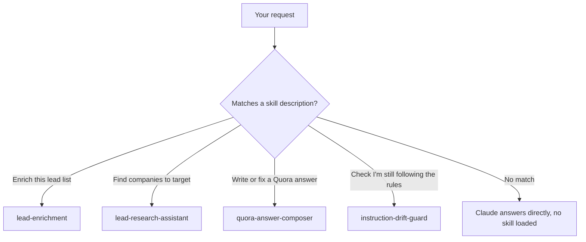

<div align="center">

# claude-skills

**Personal [Claude Agent Skills](https://docs.claude.com/en/docs/claude-code/skills) — researched, tested, and documented, not vibe-coded prompts.**

Drop a skill folder into `.claude/skills/` and Claude Code loads it automatically, matching it to your request by its `description`.

[](LICENSE)
[](#skills)
[](skills/quora-answer-composer/tests/test_validate_quora_draft.py)

[What this is](#what-this-is) · [Skills](#skills) · [Install](#install) · [How Claude picks a skill](#how-claude-picks-a-skill) · [FAQ](#faq)

</div>

---

## What this is

A [Claude Agent Skill](https://docs.claude.com/en/docs/claude-code/skills) is a folder containing a `SKILL.md` — instructions, and optionally scripts, that Claude loads dynamically when your request matches the skill's `description`. This repo is a small, growing collection of them, each built the same way: **find a real, evidence-backed problem first, then build the narrowest thing that solves it** — not a guess at what might be useful.

`quora-answer-composer` is the clearest example: built after researching actual documented Quora editor bugs (cursor jumping mid-edit, drafts silently disappearing, unexplained "poor formatting" collapses) and Quora's own published style guide, not assumptions about what Quora writers need.

## Skills

| Skill | Problem it solves | Depends on |
|---|---|---|
| [`lead-enrichment`](skills/lead-enrichment/SKILL.md) | Turn a company list into 5–10 verified decision-maker contacts per company | Parallel, Apollo, MillionVerifier API keys |
| [`lead-research-assistant`](skills/lead-research-assistant/SKILL.md) | Find high-quality target companies for your product/service and get an actionable outreach strategy | None (uses Claude's own research) |
| [`quora-answer-composer`](skills/quora-answer-composer/SKILL.md) | Draft Quora answers outside Quora's buggy editor and validate them against Quora's real formatting rules before pasting — avoids the "very poor formatting" collapse | Python 3.9+ (stdlib only) |
| [`instruction-drift-guard`](skills/instruction-drift-guard/SKILL.md) | Re-checks Claude's own output against style rules declared earlier in a long session — catches the documented drift where explicit instructions (no comments, banned phrases, quote style) get followed for a few turns then quietly ignored | Python 3.9+, `pyyaml` |

Each skill's own `SKILL.md` documents its exact trigger phrases, required setup, and what it does step by step.

## Install

```bash
git clone https://github.com/Yashraj00700/claude-skills
cp -r claude-skills/skills/lead-enrichment ~/.claude/skills/
cp -r claude-skills/skills/lead-research-assistant ~/.claude/skills/
cp -r claude-skills/skills/quora-answer-composer ~/.claude/skills/
cp -r claude-skills/skills/instruction-drift-guard ~/.claude/skills/
```

Or install just the one you need — each skill folder is self-contained and has no dependency on the others.

Each skill needs its own API keys where applicable (documented inside each `SKILL.md`) — nothing is hardcoded, nothing is bundled.

## How Claude picks a skill



Claude Code only loads a skill's full instructions when your request matches its `description` field closely enough — skills sitting unused in `.claude/skills/` cost nothing.

## Verify before you trust it

`quora-answer-composer` ships with a real test suite because "the skill says it works" isn't evidence:

```bash
cd claude-skills/skills/quora-answer-composer
pip install pytest
python -m pytest tests/ -v
```

11 tests, covering the exact patterns that trigger Quora's formatting collapse (manual bullet characters, missing paragraph spacing, bold overuse, overlong paragraphs) plus the "clean input stays clean" negative cases.

`instruction-drift-guard` ships 12 tests the same way:

```bash
cd claude-skills/skills/instruction-drift-guard
pip install pytest pyyaml
python -m pytest tests/ -v
```

## FAQ

**What is a Claude Agent Skill?**
A folder with a `SKILL.md` file — a `description` Claude matches against your requests, plus instructions and optional helper scripts. Claude Code auto-discovers skills placed in `.claude/skills/`. See [Anthropic's own skills documentation](https://docs.claude.com/en/docs/claude-code/skills) for the full spec.

**Do I need all four skills installed?**
No. Copy only the skill folder(s) you want — each is fully self-contained.

**Is instruction/style drift over a long session a real, documented problem?**
Yes — [anthropics/claude-code#77136](https://github.com/anthropics/claude-code/issues/77136) (423 reactions) and [#65961](https://github.com/anthropics/claude-code/issues/65961) (219 reactions) are both open issues on Claude Code's own repository describing exactly this. `instruction-drift-guard` was built in direct response to those, not a hypothesis.

**Why does `quora-answer-composer` tell me to draft outside Quora instead of just fixing Quora's editor?**
Because a Claude Skill can't patch a website's own JavaScript. What it can do is change your workflow to avoid the specific bugs (cursor jumping mid-edit, drafts vanishing) and validate your text against Quora's real formatting rules before you ever paste it in. See the skill's own `SKILL.md` for the cited sources behind that design.

**Are any API keys or secrets included in this repo?**
No. `lead-enrichment` requires you to supply your own Parallel/Apollo/MillionVerifier keys via environment variables — none are hardcoded or committed here.

**Can I contribute a new skill?**
Yes — open a PR. Skills accepted here follow the same bar: a real, cited problem, a narrowly-scoped solution, and tests where the skill includes any executable logic (not just prose instructions).

## License

MIT — see [LICENSE](LICENSE).
